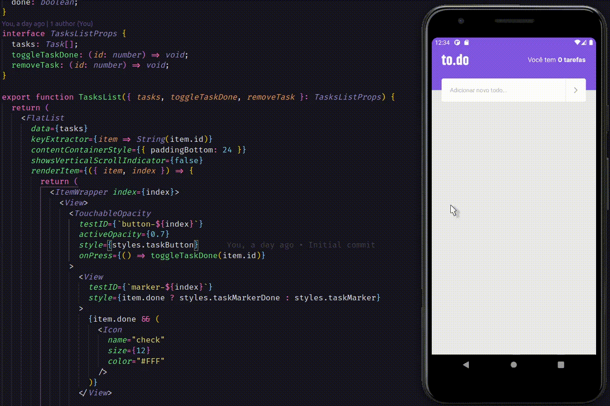

<h1 align="center">
    
</h1>

## **SOBRE**
Projeto todo-list criado ao final do primeiro capitulo do bootcamp **Ignite React Native** na **Rocketseat**


---

### **TECNOLOGIAS UTILIZADAS**
- React Native
- TypeScript

---


### **COMO RODAR O PROJETO**

## 1 Faça o clone do repositório ##
```
git clone git@github.com:alexandremolive/project-todolist-reactnative.git
```

## 2 Execute os comandos abaixo ##

```
yarn add
npm install
```
```
yarn start
npm start
```


